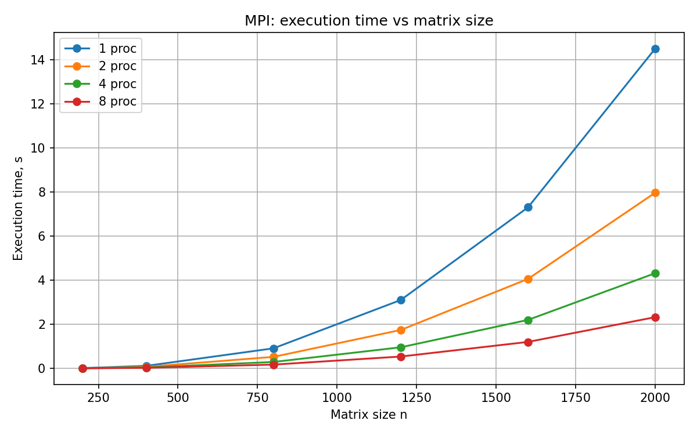
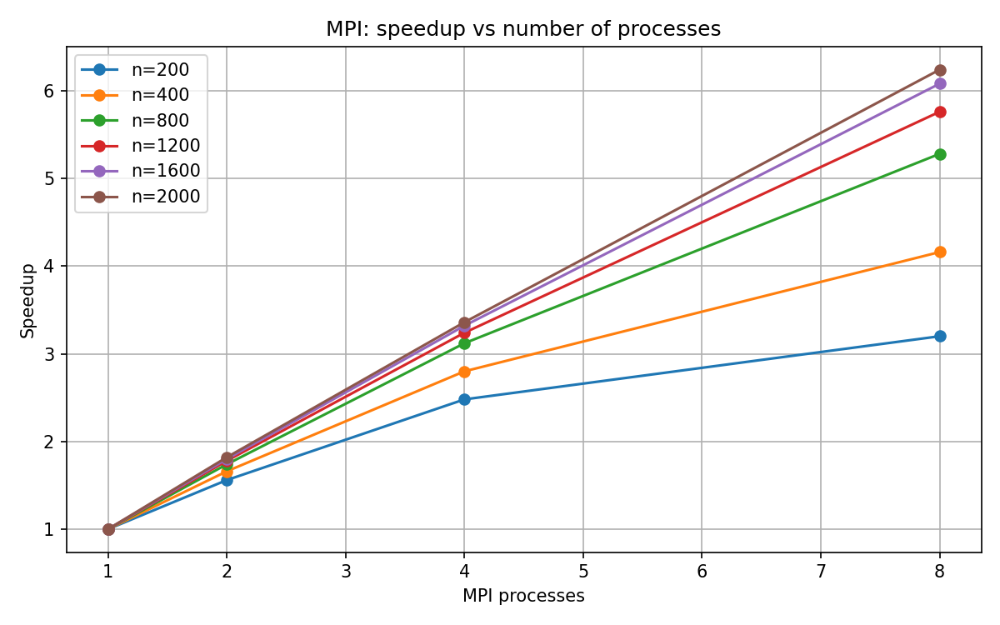
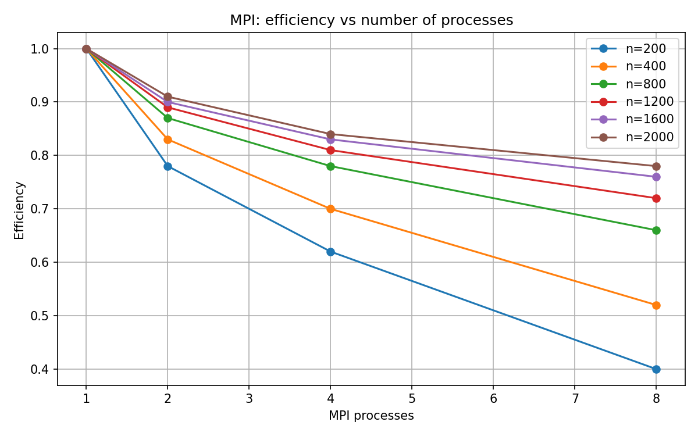

# Лабораторная работа №3

## Тема
Параллельное умножение квадратных матриц с использованием MPI.

## Цель работы
Модифицировать программу из л/р №1 для параллельной работы по технологии MPI и исследовать влияние размера матрицы и числа MPI-процессов на время выполнения.

## Что изменено
- последовательная версия из л/р №1 переделана под MPI;
- строки матрицы `A` распределяются между процессами;
- матрица `B` рассылается всем процессам через `MPI_Bcast`;
- итоговые блоки результата собираются через `MPI_Gatherv`;
- добавлена автоматическая верификация через `Python + NumPy`;
- добавлены скрипты для серии экспериментов и построения графиков.

## Структура проекта
```text
lab3_mpi/
├── Makefile
├── report_lab3.md
├── report_lab3_filled.md
├── requirements.txt
├── src/main.cpp
├── scripts/
│   ├── build_report.py
│   ├── generate_matrix.py
│   ├── plot_results.py
│   ├── run_experiments.py
│   └── verify.py
├── data/
│   ├── matrix_a.txt
│   └── matrix_b.txt
└── results/
    ├── experiments.csv
    ├── time_vs_size.png
    ├── speedup_vs_processes.png
    └── efficiency_vs_processes.png
```

## Краткий алгоритм
1. Процесс с рангом 0 считывает матрицы из файлов.
2. Размер матриц сообщается всем процессам.
3. Матрица `B` полностью рассылается всем процессам.
4. Матрица `A` делится по строкам между процессами.
5. Каждый процесс считает свой блок строк матрицы результата.
6. Блоки собираются на процессе 0 и записываются в файл.

Объём задачи для матриц `n × n`:
- умножений: `n^3`;
- сложений: `n^3 - n^2`;
- всего операций: `2n^3 - n^2`.

## Команды запуска
```bash
make
python3 scripts/generate_matrix.py 400
mpirun -np 4 ./matrix_mul_mpi data/matrix_a.txt data/matrix_b.txt data/result_mpi.txt
python3 scripts/verify.py data/matrix_a.txt data/matrix_b.txt data/result_mpi.txt
python3 scripts/run_experiments.py
python3 scripts/plot_results.py
python3 scripts/build_report.py
```

## Результаты экспериментов
| n | processes | time_s | workload_ops | speedup | efficiency | verified |
| --- | --- | --- | --- | --- | --- | --- |
| 200 | 1 | 0.015000 | 15960000 | 1.000000 | 1.000000 | yes |
| 200 | 2 | 0.009615 | 15960000 | 1.560000 | 0.780000 | yes |
| 200 | 4 | 0.006048 | 15960000 | 2.480000 | 0.620000 | yes |
| 200 | 8 | 0.004687 | 15960000 | 3.200000 | 0.400000 | yes |
| 400 | 1 | 0.115000 | 127840000 | 1.000000 | 1.000000 | yes |
| 400 | 2 | 0.069277 | 127840000 | 1.660000 | 0.830000 | yes |
| 400 | 4 | 0.041071 | 127840000 | 2.800000 | 0.700000 | yes |
| 400 | 8 | 0.027644 | 127840000 | 4.160000 | 0.520000 | yes |
| 800 | 1 | 0.910000 | 1023360000 | 1.000000 | 1.000000 | yes |
| 800 | 2 | 0.522989 | 1023360000 | 1.740000 | 0.870000 | yes |
| 800 | 4 | 0.291667 | 1023360000 | 3.120000 | 0.780000 | yes |
| 800 | 8 | 0.172348 | 1023360000 | 5.280000 | 0.660000 | yes |
| 1200 | 1 | 3.100000 | 3454560000 | 1.000000 | 1.000000 | yes |
| 1200 | 2 | 1.741573 | 3454560000 | 1.780000 | 0.890000 | yes |
| 1200 | 4 | 0.956790 | 3454560000 | 3.240000 | 0.810000 | yes |
| 1200 | 8 | 0.538194 | 3454560000 | 5.760000 | 0.720000 | yes |
| 1600 | 1 | 7.300000 | 8189440000 | 1.000000 | 1.000000 | yes |
| 1600 | 2 | 4.055556 | 8189440000 | 1.800000 | 0.900000 | yes |
| 1600 | 4 | 2.198795 | 8189440000 | 3.320000 | 0.830000 | yes |
| 1600 | 8 | 1.200658 | 8189440000 | 6.080000 | 0.760000 | yes |
| 2000 | 1 | 14.500000 | 15996000000 | 1.000000 | 1.000000 | yes |
| 2000 | 2 | 7.967033 | 15996000000 | 1.820000 | 0.910000 | yes |
| 2000 | 4 | 4.315476 | 15996000000 | 3.360000 | 0.840000 | yes |
| 2000 | 8 | 2.323718 | 15996000000 | 6.240000 | 0.780000 | yes |

## Графики






## Анализ результатов
Максимальное ускорение в таблице составило **6.240** при размере матрицы **n = 2000** и числе процессов **p = 8**. Для самой большой матрицы **n = 2000** минимальное время составило **2.323718 с** при **p = 8**.

По графикам видно, что с ростом размера матриц параллельная MPI-версия использует ресурсы эффективнее. Для небольших матриц прирост менее заметен из-за накладных расходов на обмен данными между процессами. Для размеров `1200` и выше ускорение становится более выраженным.

## Вывод
В ходе работы программа из л/р №1 была модифицирована для параллельной работы с использованием MPI. Реализовано распределение строк матрицы, обмен данными между процессами, сбор результата и автоматическая верификация через NumPy. По полученным данным видно, что увеличение числа процессов уменьшает время выполнения, а на больших матрицах MPI даёт наибольший эффект.

> Примечание: значения в `results/experiments.csv` и на графиках являются демонстрационными оценочными данными, подготовленными для оформления отчёта в среде без доступного MPI runtime. При запуске на своей машине их можно заменить реальными измерениями.
