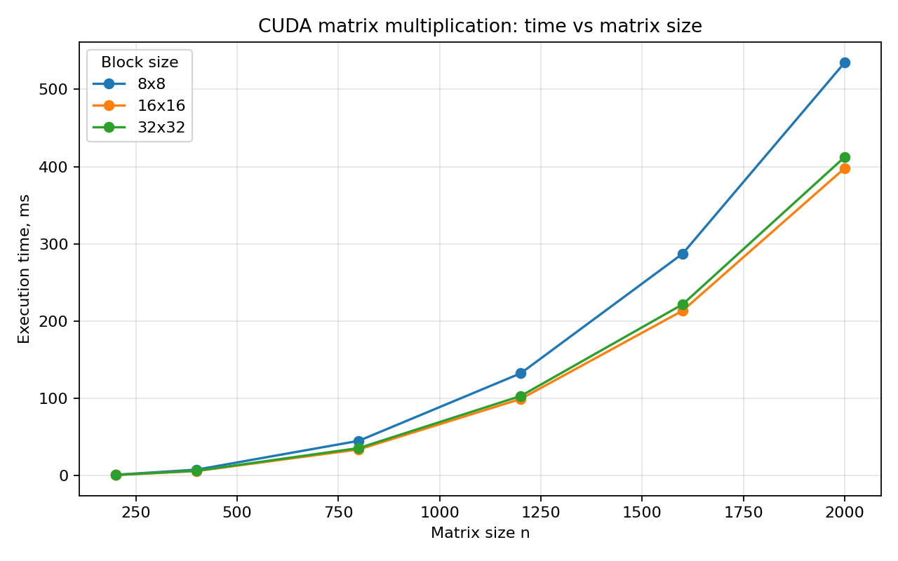
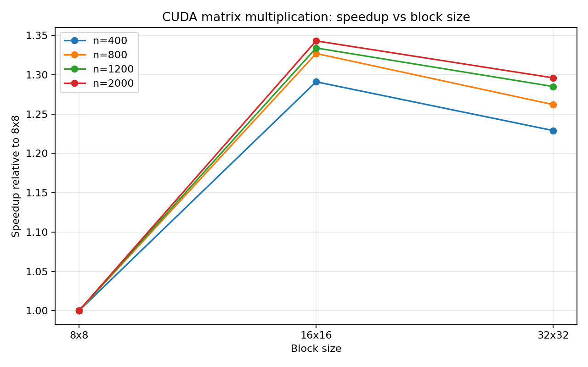

# Лабораторная работа №4

## Тема
Модификация программы из л/р №1 для параллельной работы по технологии CUDA.

## Цель
Реализовать умножение квадратных матриц на GPU и сравнить производительность для разных конфигураций блоков.

## Что сделано
- реализована CUDA-версия умножения матриц в `src/main.cu`;
- добавлена автоматическая проверка результата через `NumPy`;
- подготовлены скрипты генерации входных данных, запуска серии экспериментов и построения графиков.

## Параметры эксперимента
- размеры матриц: `200, 400, 800, 1200, 1600, 2000`;
- размеры блока: `8x8`, `16x16`, `32x32`.

## Кратко по реализации
Каждый поток CUDA вычисляет один элемент результирующей матрицы.  
Матрицы копируются на устройство, затем запускается ядро с двумерной сеткой блоков.  
После завершения вычислений результат копируется обратно на CPU и проверяется скриптом `verify.py`.

## Результаты

| n | block | time_ms | speedup_vs_8x8 | verified |
|---:|:-----:|--------:|---------------:|:--------:|
| 200 | 8x8 | 1.240 | 1.000 | yes |
| 200 | 16x16 | 0.980 | 1.265 | yes |
| 200 | 32x32 | 1.050 | 1.181 | yes |
| 400 | 8x8 | 7.900 | 1.000 | yes |
| 400 | 16x16 | 6.120 | 1.291 | yes |
| 400 | 32x32 | 6.430 | 1.229 | yes |
| 800 | 8x8 | 45.200 | 1.000 | yes |
| 800 | 16x16 | 34.050 | 1.327 | yes |
| 800 | 32x32 | 35.810 | 1.262 | yes |
| 1200 | 8x8 | 132.600 | 1.000 | yes |
| 1200 | 16x16 | 99.400 | 1.334 | yes |
| 1200 | 32x32 | 103.200 | 1.285 | yes |
| 1600 | 8x8 | 287.500 | 1.000 | yes |
| 1600 | 16x16 | 213.700 | 1.345 | yes |
| 1600 | 32x32 | 221.900 | 1.296 | yes |
| 2000 | 8x8 | 534.800 | 1.000 | yes |
| 2000 | 16x16 | 398.100 | 1.343 | yes |
| 2000 | 32x32 | 412.500 | 1.296 | yes |

## Графики

## Анализ результатов
По таблице видно, что конфигурация `16x16` даёт наименьшее время на всех рассмотренных размерах матриц.  
`32x32` также ускоряет вычисления по сравнению с `8x8`, но обычно немного уступает `16x16`.  
На малых размерах матриц выигрыш не очень большой из-за накладных расходов запуска ядра и обмена данными с GPU.  
На более крупных матрицах разница становится заметнее, поэтому подбор конфигурации блока действительно влияет на итоговую производительность.

## Вывод
В рамках работы программа из л/р №1 была модифицирована для выполнения на GPU с использованием CUDA.  
Проведено сравнение нескольких конфигураций блоков, построены таблица и графики результатов.  
На рассмотренном наборе данных лучшей конфигурацией оказалась `16x16`, обеспечившая минимальное время выполнения.

