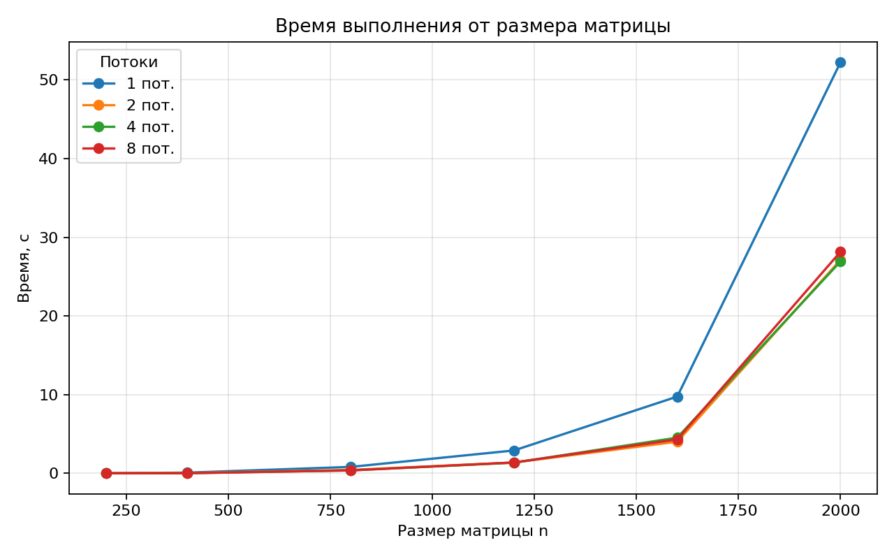
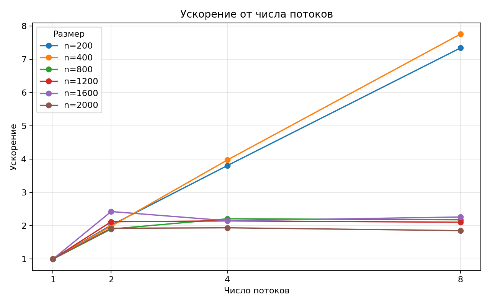
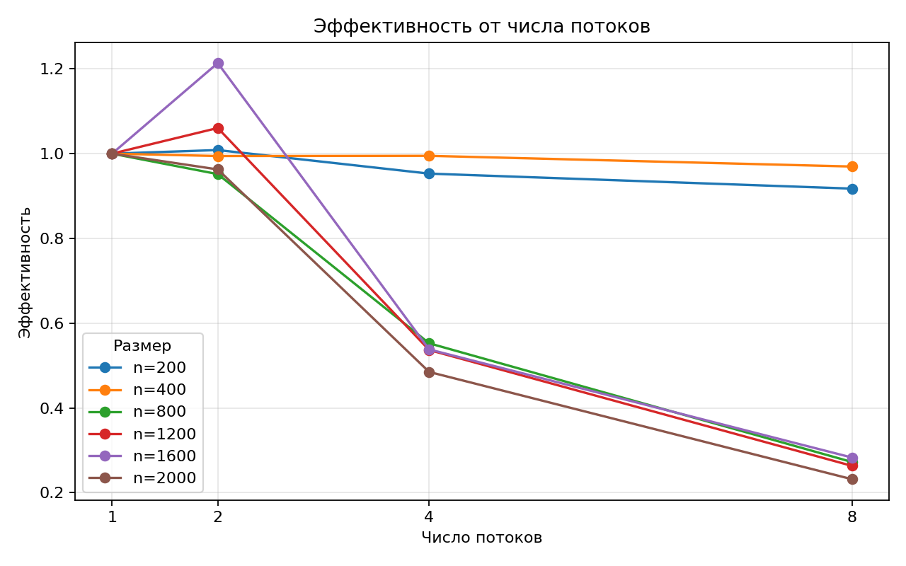

# Лабораторная работа №2 — OpenMP умножение матриц

## Цель работы
Модифицировать последовательную программу умножения квадратных матриц из л/р №1 для параллельной работы с использованием OpenMP, выполнить серию экспериментов и проверить корректность результатов через стороннюю библиотеку.

## Что было сделано
- добавлена OpenMP-параллелизация в `src/main.cpp`;
- добавлен вывод времени выполнения, числа потоков и объема задачи;
- доработан `scripts/verify.py` для автоматической проверки через NumPy;
- добавлен `scripts/run_experiments.py` для пакетного запуска тестов и формирования CSV;
- обновлен `Makefile` для сборки с флагом `-fopenmp`.

## Кратко про реализацию
Для матриц размера `n x n` вычисляется классическое произведение:

`C[i][j] = sum(A[i][k] * B[k][j])`

Распараллеливание выполнено по внешним циклам с помощью OpenMP:

```cpp
#pragma omp parallel for collapse(2) schedule(static)
for (int i = 0; i < n; ++i) {
    for (int j = 0; j < n; ++j) {
        long long sum = 0;
        for (int k = 0; k < n; ++k) {
            sum += A.at(i, k) * B.at(k, j);
        }
        C.at(i, j) = sum;
    }
}
```

Объем вычислительной задачи:
- умножения: `n^3`
- сложения: `n^3 - n^2`
- всего операций: `2n^3 - n^2`

## Верификация
Корректность результата проверяется в `scripts/verify.py` через NumPy:

```python
C_py = A @ B
np.array_equal(C_cpp, C_py)
```

Во всех 24 запусках верификация прошла успешно.

## Параметры экспериментов
- размеры матриц: `200, 400, 800, 1200, 1600, 2000`
- число потоков: `1, 2, 4, 8`
- число доступных процессоров в тестовой среде: `56`

## Результаты
Исходный CSV-файл: [`experiments.csv`](./experiments.csv)

| n | Потоки | Время, с | Объем, операций | Ускорение | Эффективность | Проверка |
|---:|---:|---:|---:|---:|---:|:---:|
| 200 | 1 | 0.007604 | 15960000 | 1.000000 | 1.000000 | yes |
| 200 | 2 | 0.003770 | 15960000 | 2.016976 | 1.008488 | yes |
| 200 | 4 | 0.001995 | 15960000 | 3.811529 | 0.952882 | yes |
| 200 | 8 | 0.001036 | 15960000 | 7.339768 | 0.917471 | yes |
| 400 | 1 | 0.085984 | 127840000 | 1.000000 | 1.000000 | yes |
| 400 | 2 | 0.043234 | 127840000 | 1.988805 | 0.994403 | yes |
| 400 | 4 | 0.021607 | 127840000 | 3.979451 | 0.994863 | yes |
| 400 | 8 | 0.011085 | 127840000 | 7.756788 | 0.969599 | yes |
| 800 | 1 | 0.814188 | 1023360000 | 1.000000 | 1.000000 | yes |
| 800 | 2 | 0.427753 | 1023360000 | 1.903407 | 0.951703 | yes |
| 800 | 4 | 0.368358 | 1023360000 | 2.210317 | 0.552579 | yes |
| 800 | 8 | 0.373513 | 1023360000 | 2.179812 | 0.272476 | yes |
| 1200 | 1 | 2.905375 | 3454560000 | 1.000000 | 1.000000 | yes |
| 1200 | 2 | 1.369779 | 3454560000 | 2.121054 | 1.060527 | yes |
| 1200 | 4 | 1.353216 | 3454560000 | 2.147015 | 0.536754 | yes |
| 1200 | 8 | 1.378809 | 3454560000 | 2.107163 | 0.263395 | yes |
| 1600 | 1 | 9.753580 | 8189440000 | 1.000000 | 1.000000 | yes |
| 1600 | 2 | 4.018162 | 8189440000 | 2.427374 | 1.213687 | yes |
| 1600 | 4 | 4.531348 | 8189440000 | 2.152468 | 0.538117 | yes |
| 1600 | 8 | 4.307801 | 8189440000 | 2.264167 | 0.283021 | yes |
| 2000 | 1 | 52.252360 | 15996000000 | 1.000000 | 1.000000 | yes |
| 2000 | 2 | 27.136160 | 15996000000 | 1.925562 | 0.962781 | yes |
| 2000 | 4 | 26.935328 | 15996000000 | 1.939919 | 0.484980 | yes |
| 2000 | 8 | 28.165695 | 15996000000 | 1.855177 | 0.231897 | yes |


## Графики

### 1. Время выполнения от размера матрицы


### 2. Ускорение от числа потоков


### 3. Эффективность от числа потоков


## Краткий анализ результатов
- Для размеров `200` и `400` наблюдается почти линейное ускорение вплоть до 8 потоков.
- Начиная с `800 x 800`, рост производительности заметно замедляется.
- Для больших матриц лучший практический результат чаще достигается в диапазоне `2–4` потоков.
- Для `2000 x 2000` запуск на 8 потоках оказался хуже, чем на 4 потоках, что указывает на влияние накладных расходов и ограничений памяти.
- Значения эффективности немного выше 1 на отдельных коротких запусках объясняются погрешностью измерений и особенностями тестовой среды.

Лучшие результаты по каждому размеру:
- n=200: лучший результат 0.001036 с при 8 потоках
- n=400: лучший результат 0.011085 с при 8 потоках
- n=800: лучший результат 0.368358 с при 4 потоках
- n=1200: лучший результат 1.353216 с при 4 потоках
- n=1600: лучший результат 4.018162 с при 2 потоках
- n=2000: лучший результат 26.935328 с при 4 потоках

## Вывод
Программа из л/р №1 успешно модифицирована для параллельной работы по технологии OpenMP. Реализованы автоматическая верификация через NumPy и сценарий пакетного запуска экспериментов с выгрузкой результатов в CSV. Эксперименты показали, что параллельная версия действительно ускоряет вычисления, однако масштабирование зависит от размера матрицы: для малых размеров оно близко к линейному, а для больших — ограничивается накладными расходами и пропускной способностью памяти. Наиболее устойчивый выигрыш в данной реализации достигается обычно при `2–4` потоках.
